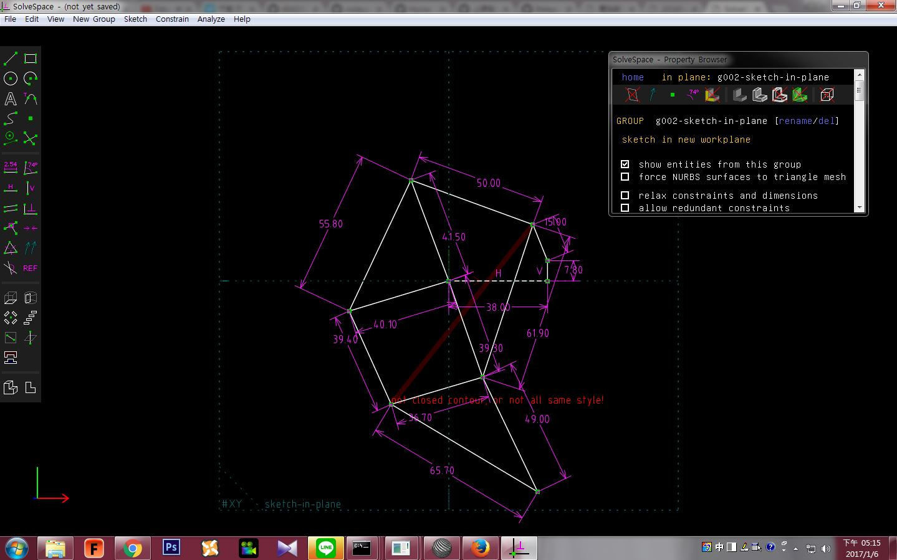
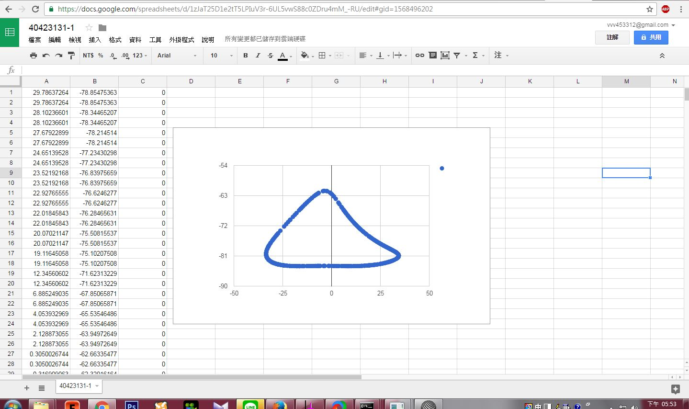

Title: 40423131 四連桿機構
Date: 2016-11-17 11:00
Category: HW
Tags: 作業
Author: 40423131 

40423131 W7作業

<!-- PELICAN_END_SUMMARY -->

##Solvespace 平面四連桿機構模擬

Solvespace 影片

<iframe src="https://player.vimeo.com/video/198318410" width="640" height="363" frameborder="0" webkitallowfullscreen mozallowfullscreen allowfullscreen></iframe>

<a href="https://vimeo.com/198318410">Solvespace 平面四連桿機構模擬</a> from <a href="https://vimeo.com/user44207151">40423131</a> on <a href="https://vimeo.com">Vimeo</a>.

將所得到的點座標的.csv以Excel的畫圖，得到：

